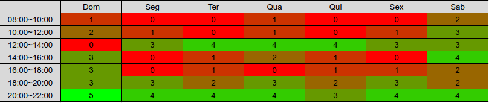

# Planejamento

A ferramenta Google Calendar está sendo usada para o planejamento do cronograma do projeto.

## Metodologia
O grupo fará reuniões semanais para organização e avaliação das atividades. As ferramentas utilizadas podem ser encontradas na página [Home](../index.md).

## Heatmap

O Heatmap é útil para auxiliar no planejamento quanto a disponibilidade dos integrantes do grupo durante a realização do projeto.

## Roadmap
Segue abaixo a tabela com os pontos de controle do projeto e principais técnicas utilizadas.

| Pré-rastreabilidade - 07/09 | Elicitação - 28/09 | Modelagem - 09/10            | Modelagem - 28/10      | Análise - 09/11 | Pós-rastreabilidade - 26/11
| :-------------------------: | :----------------: | :--------------------------: | :--------------------: | :-------------: | :-------------------------: |
| Rich Picture                | Introspecção       | Cenários                     | Backlogs               | NFR             | Backward-from       
| Wiki                        | Observação         | Léxico                       | Histórias de Usuário   | Casos de uso    | Foward-from
| Planejamento                | Brainstorming      | Casos de uso                 | NFR                    | Rich Pictures   | EAP               
|                             | Priorização        | Especificação Suplementar    |                        | Observação      |                    
|                             |                    |                              |                        | Léxicos         |                    
|                             |                    |                              |                        | Brainstorming   |                    
|                             |                    |                              |                        |                 |
**As técnicas serão atualizadas conforme o progresso da disciplina.*

## Versionamento
<table>
    <tr>
        <th>Autor</th>
        <th>Versão</th>
        <th>Data(dd/mm/aaaa)</th>
        <th>Descrição</th>
    <tr>
    <tr>
        <td>Wagner Martins</td>
        <td>1.0</td>
        <td>04/09/2020</td>
        <td>Anotação dos pontos de controle</td>
    </tr>
    <tr>
        <td>Wagner Martins</td>
        <td>1.1</td>
        <td>06/09/2020</td>
        <td>Adição do heatmap e metodologia</td>
    </tr>
</table>